# MY READ ME FILE 
Here is where i will be documenting the development of my website as well as the all weekly tasks that i am assigned. 

## Week 1 
In todays seminar during hour 2 were tasked with the following: 

### - Create your first web page (in this class)

#### Pick one topic:
Intro about yourself, styling & organising a poem, song lyrics, book fragment, etc.
Think about how you want to represent your personality or the selected text as a web page
use CSS text styling elements, incl. font-face, font, colours, etc.

In class i used the demo code and started by first doing a little introduction about myself and then alter the colour of the background and the font of the website header. 

This is the colour scheme i decided to use i, i wanted to use these colours as i felt like they contrasted eachother well whilst still looking appealing, i also liked that they came with their hex code this made it easier for mw to actually change the colour of things. 

The colour pallet:
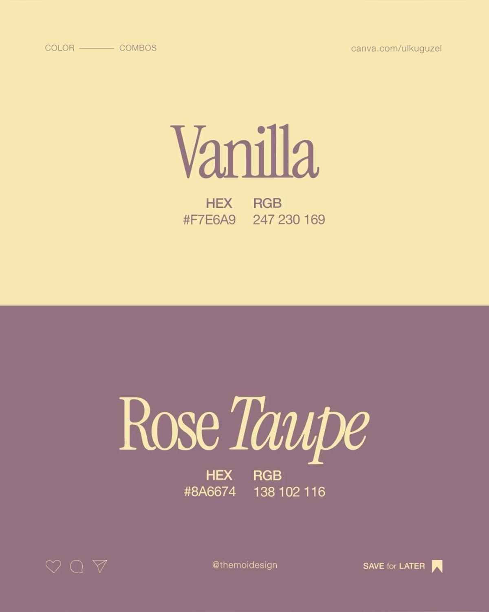

The code:
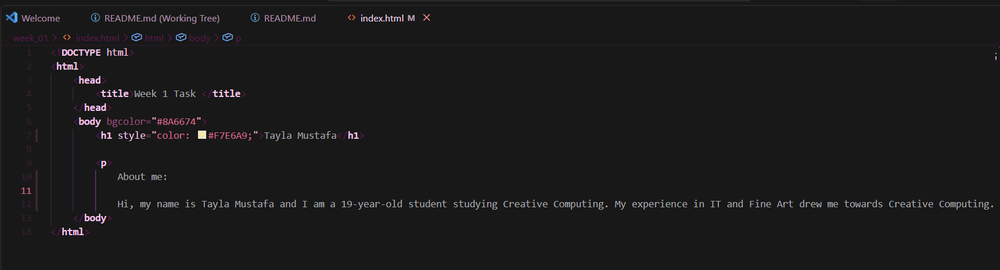 

The webpage so far:
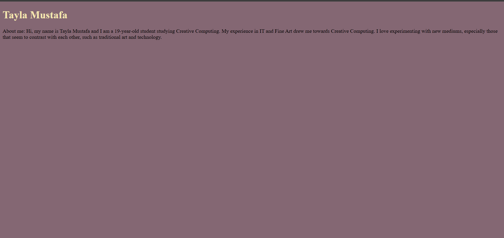 

After i did this i next i needed to change the font of my text,i first go on google fonts to look at what styles whould suite ny portfolio website best, i wanted something that matched the font used on the colour pallet image and found this font that was similar 

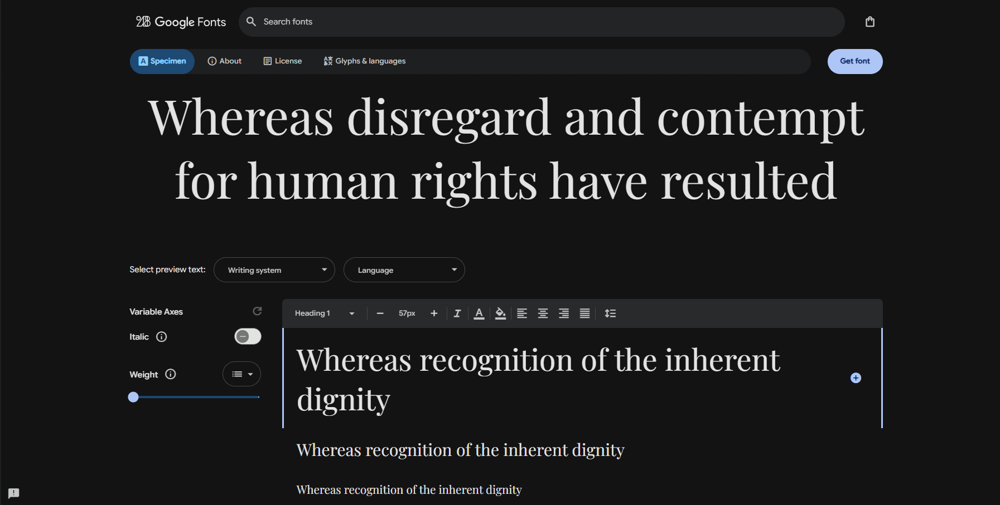 

i clicked get font and then i got the embeded code for HTML that google provides and incerted it into my code 

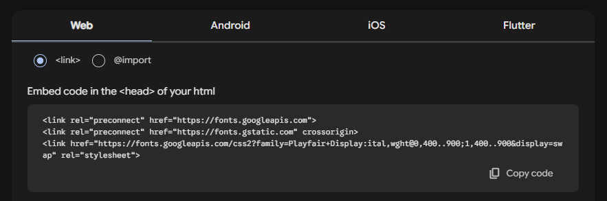 

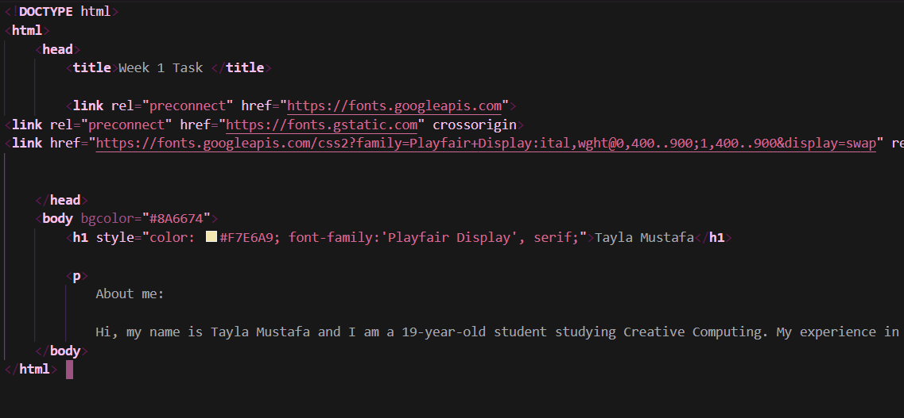 

This has now changed the apperance of my introduction and title: 
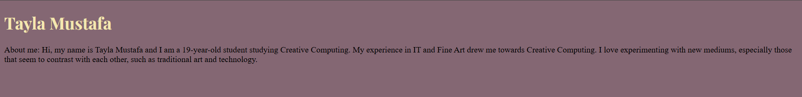 

## sources used to help change fornt: 
https://www.youtube.com/watch?v=g15mF_XAOB8
https://www.w3schools.com/tags/tag_font.asp

#### Now that the in class task is completed i can begin week 1s work 
Make a copy of the task from Hr 2. Make at least 1 new version of it and make the text easy to read according to the guidelines from resources below.

Think about:
- font size

- colours 

- contrast

- line length

- line spacing

- semantic structure: include at least section, 2 header levels, paragraph tags.

- Add an image to the page and ensure to add alt text.

In the documentation, include ~200 words on: 
screenshots of the different page versions
a description of what you did
a reflection on how the accessibility & readability of your page changed.

Points of improvements: 

As someone who is dyslexic there are some immediate factors that can be altered to make it a little more accessible. 

- text size 
- text placement 
- site structure 
- line spacing 
- font 
- potentially colour pallet

### Text size 
Currently my web page title and about me section is quite small, this makes it hard to see what is written and hard to navigate the site. 

I first changed the size of my header i experimented with a few diffrent sizes 

#### Size 90px: 
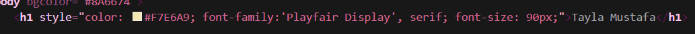 

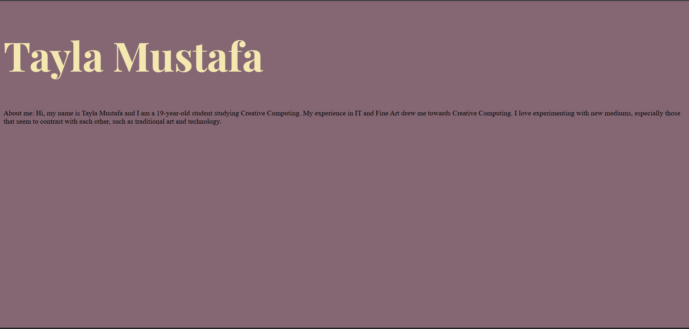

#### Size 80px: 

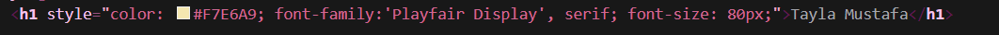

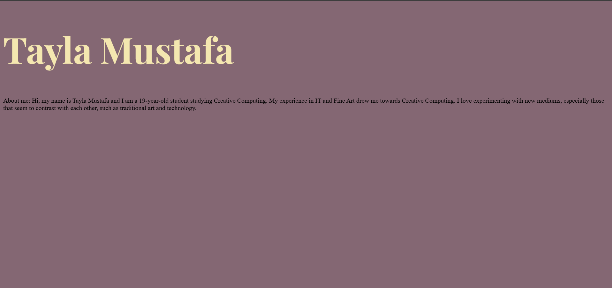

#### Size 60px:
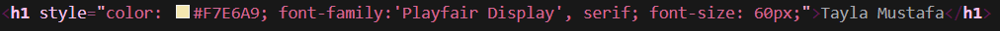

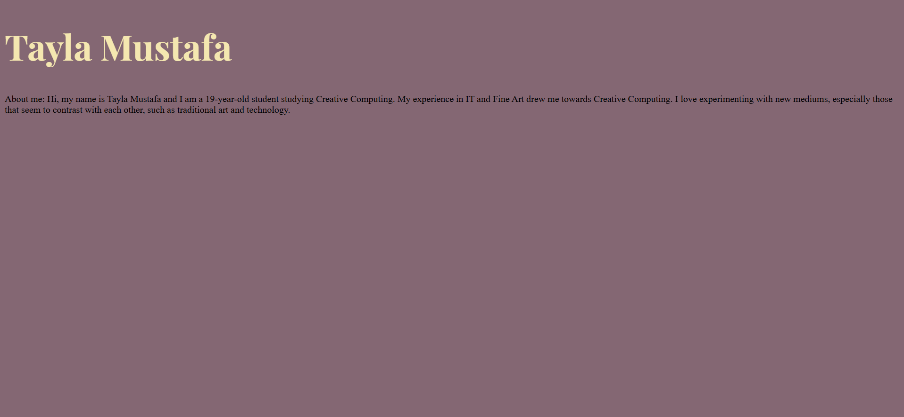

After experimenting with a few diffrent sizes i have decided to make my header 90px size as 80xp doesnt make a crazy diffrence sizewise compared to the 90px and the 60px is too small 

